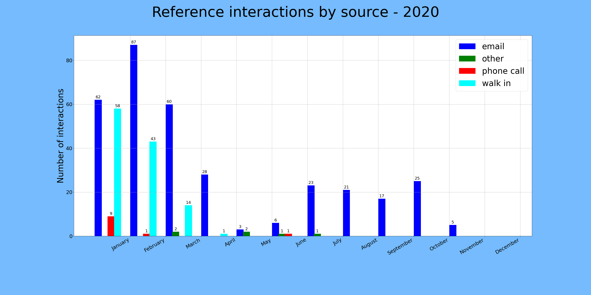
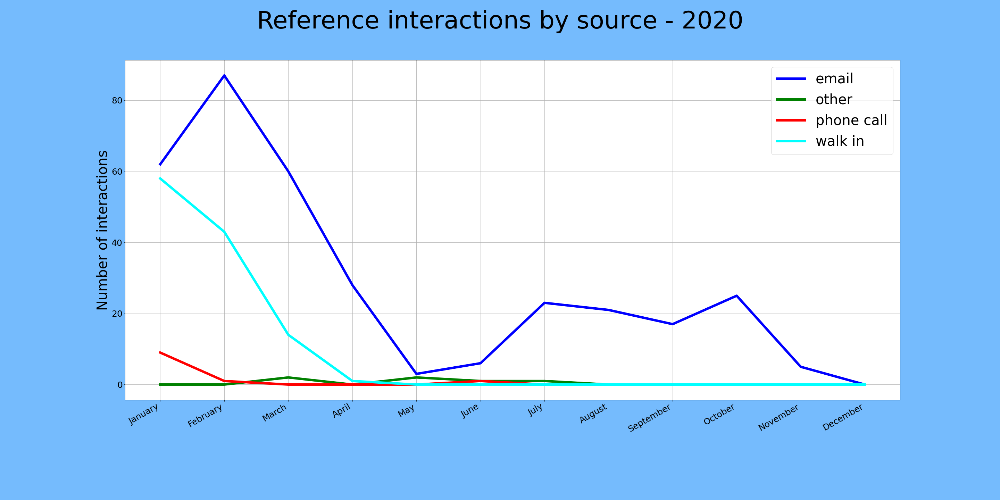
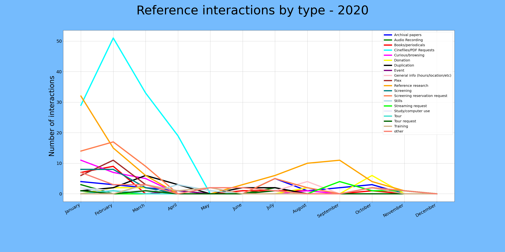

# Libstats Visualizations

This Jupyter notebook is an initial stab at visualizing the PFA library statistics that we keep with a Google form.

The resulting CSV is saved and parsed to produce a visualization of one or another variable over time. Currently, you can change the variable in `index_col='interaction type'` to be the variable of interest. I've only found that 'interaction type' and 'interaction source' are useful with this kind of plot, but I'll be looking at other types....

Also, the CSV included here is slightly sanitized to remove personal information :)

Also also, the data is not complete/not everyone enters stats consistently ;)

## Usage

To run this, start Jupyter (`jupyter notebook`), navigate to this directory, and open up the `Libstats_visualization.ipynb`. Then `Run all cells` and see what pops up!

## Requirements

* Python3
* Jupyter (`pip3 install jupyterlab`)
* pandas (`pip3 install pandas`)
* matplotlib (`pip3 install matplotlib`)
* numpy (`pip3 install numpy`)

(`pip` might install pandas, matplotlib, and numpy when you install jupyter....)

 

  
